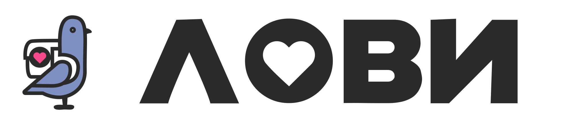
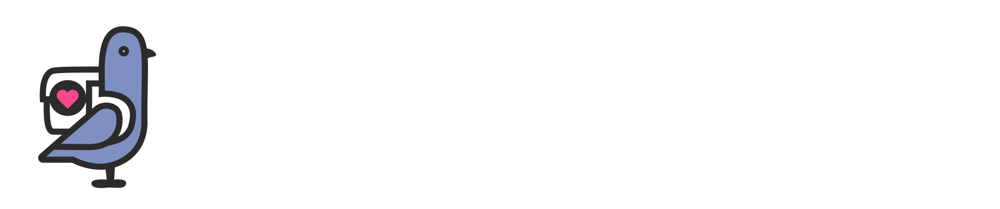

# Скил: дизайн-система LOVII

## Когда применять

- Создаёшь или правишь HTML/CSS/Tailwind любого клиентского экрана LOVII
- Добавляешь компонент (кнопку, карточку, пилюлю, форму, шит, дашборд)
- Собираешь экран для роли: клиент / бизнес / партнёр / амбассадор / инвестор
- Пишешь или правишь тексты интерфейса (кнопки, тосты, empty-состояния, ошибки, юр.блок)
- Проверяешь вёрстку перед деплоем (приёмка)
- Отвечаешь на вопрос о значении стиля (цвет, отступ, радиус, тень, анимация)

## Источники (в порядке приоритета)

1. `tokens/tokens.css` — значения (CSS-переменные `--lv-*`)
2. `tokens/design-tokens.json` — те же значения машинночитаемо
3. `docs/01…06` — правила применения (каждый раздел с Do/Don't)
4. `docs/07-patterns.md` — **copy-paste сниппеты всех компонентов** (тема, кнопки, карточки, формы, шит, тост, навигация + таблица антипаттернов)
5. `docs/09-components.md` — анатомия компонентов, сетка состояний, иконки
6. `docs/10-ux-patterns.md` — UX-паттерны: якоря/scroll, адаптив, PWA-установка, hash-роутинг
7. `docs/11-brand-voice.md` — **бренд и тон**: голос (5 принципов), матрица тона, словарь, канонические формулировки состояний, юр.блок, иллюстрации
8. `examples/01…07.html` — **референс-экраны по ролям + UX-лаборатория + Тон-лаборатория** (готовые страницы, обе темы)
9. `docs/08-recipes.md` — пошаговые рецепты типовых задач (новый экран, новый токен, приёмка…)
10. `style-guide.html` — визуальный эталон (открыть в браузере, переключить тему)
11. `docs/checklist.md` — приёмка перед завершением (вкл. §12 «Текст и тон»)

## Карта ролей → референсы

| Роль | Пример | Каркас | Что смотреть в первую очередь |
|---|---|---|---|
| Клиент (витрина) | `examples/01-client-store.html` | капсула 480px | bottom-nav, карточки товаров, ленты, тост |
| Бизнес (дашборд) | `examples/02-business-dashboard.html` | wide 1120px | KPI, сегменты, списки статусов |
| Партнёр | `examples/03-partner-portal.html` | narrow 760px | статус на `gradient-ink`, деньги, прогресс |
| Амбассадор | `examples/04-ambassador-program.html` | narrow 760px | уровни на `tile-*`, промокод градиентным текстом |
| Инвестор | `examples/05-investor-overview.html` | narrow 760px | метрики, таймлайн, документная подача |

Не ролевые референсы: `examples/06-ux-lab.html` — UX-лаборатория (живые демо scroll/адаптив/PWA/hash-роутинга, docs/10); `examples/07-voice-lab.html` — Тон-лаборатория (голос, матрица тона, канонические тексты, юр.блок, docs/11).

Собирая новый экран — начинай с копии каркаса референса роли.

## Краткая выжимка (детали — в docs/)

- **Цвет**: акценты `--lv-pink #f64a8a` / `--lv-tiffany #0abab5` / `--lv-gold #d4a854` не меняются по темам; темы меняют только поверхности (`bg #f8f5f0↔#171219`, `card #ffffff↔#211b26`, `surface #f8f8f8↔#2b2331`) и текст (`ink #1a1a1a↔#f3ebf0`, `dim #888888↔#a798a6`). Чистые `#000`/`#fff` в тексте запрещены (кроме `--lv-on-brand` на градиентах).
- **Soft-пары**: `soft-pink→pink-dark`, `soft-tiffany→tiffany-text`, `soft-gold→gold-text`, `grey-soft→#999`. Не смешивать тоны.
- **Типографика**: Inter 400–800; заголовки 800; шкала 26/20/18/16/14/13/12/11/10px; абзацы lh 1.6; uppercase только с letter-spacing ≥0.06em.
- **Геометрия**: контролы `999px` (пилюли), карточки `16px`, шиты/премиум `24/20px`, плитки `12px`. Боковой отступ `16px`, секция `20px`, заголовок↔контент `12px`.
- **Тени**: покой `--lv-shadow-soft`, интерактив `--lv-shadow-lift` (розовый). Других теней нет.
- **Движение**: hover 0.2s, нажатие scale .95–.97 за 0.15s, вход `.lv-enter` 0.35s, шит cubic-bezier(.32,.72,0,1). `prefers-reduced-motion` — обязательно отключить (уже в tokens.css).
- **Каркас**: капсула 480px (мобайл) → 1120px wide / 760px narrow (≥640px); хедер 56px; нижняя навигация 64px → плавающая капсула ≥900px; брейкпоинты 640/900/1024.
- **Голос и тексты**: на «ты», коротко, глаголы действия, конкретика (минуты пешком, «до ЧЧ:ММ», «249 ₽»), без вины пользователя; «!» ≤1 на экран; эмоджи запрещены; формулировки тостов/empty — docs/11 §5; тон по ситуации — матрица docs/11 §2.

## Критичные сниппеты (всегда с собой)

### Тема: head-порядок

```html
<script>/* anti-FOUC: ДО CSS */
(function(){try{var t=localStorage.getItem('lovii_theme');
if(!t){t=matchMedia('(prefers-color-scheme: dark)').matches?'dark':'light';}
document.documentElement.setAttribute('data-theme',t);}catch(e){}})();
</script>
<link rel="stylesheet" href="tokens/tokens.css">
<meta name="theme-color" id="metaTheme" content="#f64a8a">
```

```js
function applyTheme(t){
  document.documentElement.setAttribute('data-theme', t);
  try{ localStorage.setItem('lovii_theme', t); }catch(e){}
  var m = document.getElementById('metaTheme');
  if(m) m.content = t === 'dark' ? '#171219' : '#f64a8a';
}
```

### Логотипы: оба в DOM, видимость через CSS

```html


```
```css
img.logo-dark-img, img.logo-light-img { display:block; height:28px; width:auto; }
html[data-theme="light"] img.logo-dark-img { display:none; }
html[data-theme="dark"]  img.logo-light-img { display:none; }
```
Навигация ДС: на любой странице ДС подключай `<script src="assets/nav.js" defer></script>` перед `</body>` — кнопка «☰» + шит-меню между хабом, гайдом и референсами (docs/07 §14).

Иконки: ТОЛЬКО SVG из `assets/icons.svg` (`<svg class="ico" aria-hidden="true"><use href="assets/icons.svg#i-heart"/></svg>`). Эмоджи в UI запрещены (v1.3). Размеры/цвета иконок и анатомия компонентов — `docs/09-components.md`.

Остальные компоненты — бери готовыми из `docs/07-patterns.md` (§1–§14) и `docs/09-components.md` (анатомия + состояния), не пиши с нуля. Поведение экрана (якоря, адаптив, PWA, hash-роутинг) — по `docs/10-ux-patterns.md`, живые демо — `examples/06-ux-lab.html`.

## Процедура работы

1. Определи роль экрана → открой её референс из `examples/`, скопируй каркас и `<head>`.
2. Компоненты собирай из сниппетов `docs/07-patterns.md`. Если значения нет в tokens.css — сначала предложи новый токен (`--lv-*`), внеси в `tokens/tokens.css` + `tokens/design-tokens.json`, пересобери гайд (`python3 tools/build-style-guide.py`), и только потом используй.
3. Пиши код только на токенах. Хардкод значений запрещён (исключения-канон-литералы: `#999`, badge-подложки `#fde8f1/#e0f7f6/#f7edda`).
4. Проверь обе темы (style-guide + локально), оба вьюпорта (375 и десктоп).
5. Прогони `docs/checklist.md` — все пункты; автоматические grep-проверки — `docs/08-recipes.md` Р5.
6. Обнови `CHANGELOG.md` (semver) и, если менялись значения/правила, — соответствующий docs-раздел.

## Запреты (частые ошибки)

- Не менять брендовые акценты между темами
- Не использовать `filter: invert` / React-state для тем
- Не ставить `data-theme` на body (только `<html>`)
- Не изобретать радиусы, тени, длительности, размеры шрифта вне шкал
- Не смешивать soft-заливку одного тона с текстом другого
- Не редактировать `style-guide.html` руками — только через `tools/build-style-guide.py`
- Не восстанавливать высветленный логотип `lovii-logo-dark.svg` (удалён из канона)
- Для демки: не забывать поднимать `?v=N` и `CACHE lovii-vN`

## Ссылки на продукты

- Витрина (канон): https://lovii.mobiap.com — репо `bestdeejay-design/lovii_demo`, ветка master
- Посадка: https://bestdeejay-design.github.io/lovii-site/ — репо `bestdeejay-design/lovii-site` (Next.js в `site-src/`, Tailwind-маппинг `--color-lovii-*`)
- Маппинг имён легаси ↔ канон и таблица расхождений: `docs/06-application.md`
